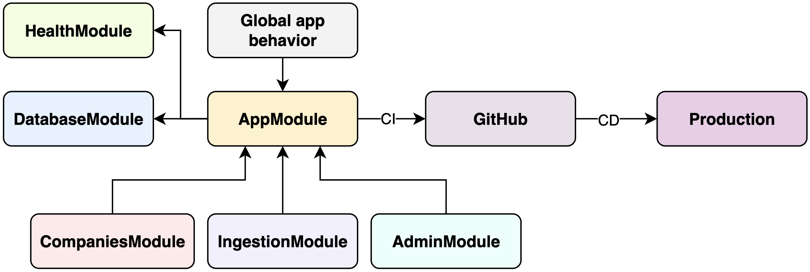
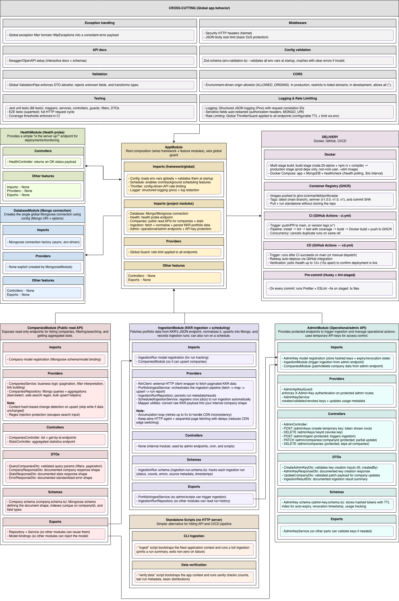
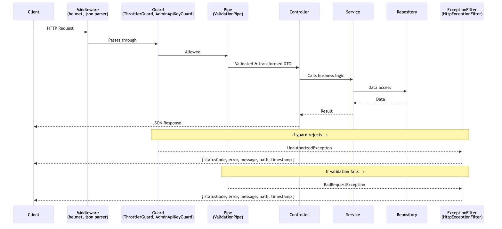

# PortfoRadar

[](https://github.com/armanfeili/PortfoRadar/actions/workflows/ci.yml)

A NestJS application that ingests and serves KKR's investment portfolio company data through a queryable REST API.

## 🌐 Live Demo

| Resource | URL |
|----------|-----|
| **Swagger UI - API** | https://portforadar-production.up.railway.app/api/docs |
| **Health** | https://portforadar-production.up.railway.app/health |
| **Stats** | https://portforadar-production.up.railway.app/stats |
| **Companies** | https://portforadar-production.up.railway.app/companies |

> **Note**: If the deployed instance shows 0 companies, ingestion may need to be triggered. See [Ingesting Data on Deployed Instance](#ingesting-data-on-deployed-instance).

## Overview

PortfoRadar fetches portfolio company information from KKR's public API, normalizes the data, and stores it in MongoDB. It provides a comprehensive REST API with filtering, pagination, full-text search, and aggregated statistics.

## Features

- **Data Ingestion**: Automated fetching from KKR's portfolio API with field normalization
- **REST API**: Full CRUD-style endpoints with advanced filtering
- **Search**: Case-insensitive regex search across company names and descriptions
- **Pagination**: Offset-based pagination with configurable limits
- **Statistics**: Aggregated counts by asset class, industry, region, and year
- **OpenAPI Documentation**: Interactive Swagger UI at `/api`
- **Health Checks**: Kubernetes-ready health endpoints

## Tech Stack

| Component | Technology |
|-----------|------------|
| Runtime | Node.js 20 LTS |
| Language | TypeScript 5.7 |
| Framework | NestJS 11 |
| Database | MongoDB 7 + Mongoose |
| Logging | Pino (nestjs-pino) |
| Documentation | Swagger/OpenAPI |
| Testing | Jest |
| Container | Docker (multi-stage build) |

## Quick Start

### Option A: Docker Compose (Recommended)

The fastest way to get running:

```bash
# Clone and start
git clone https://github.com/armanfeili/PortfoRadar && cd PortfoRadar
docker compose up --build

# In another terminal, ingest data
docker compose exec app npm run ingest:prod

# Verify data
curl http://localhost:3000/companies | jq '.total'
```

### Option B: Pre-built Docker Image

Pull the pre-built image from GitHub Container Registry:

```bash
# Pull latest image
docker pull ghcr.io/armanfeili/portforadar:latest

# Start MongoDB
docker run -d --name mongo -p 27017:27017 mongo:7

# Run the app
docker run -d --name portforadar \
  -p 3000:3000 \
  -e MONGO_URI=mongodb://host.docker.internal:27017/portfolioradar \
  ghcr.io/armanfeili/portforadar:latest

# Ingest data
docker exec portforadar node dist/ingest.js

# Verify
curl http://localhost:3000/companies | jq '.total'
```

> See [docs/Guides/CONTAINER_REGISTRY.md](docs/Guides/CONTAINER_REGISTRY.md) for more details.

### Option C: Local Development

**Prerequisites:**
- Node.js 20.x (`nvm use` if using nvm)
- MongoDB 7.x running locally or via Docker

```bash
# Install dependencies
npm install

# Configure environment
cp .env.example .env
# Edit .env if needed (defaults work with local MongoDB)

# Start MongoDB (if not already running)
docker run -d -p 27017:27017 --name mongo mongo:7

# Start in development mode
npm run start:dev

# Ingest data
npm run ingest

# Open Swagger UI
open http://localhost:3000/api/docs
```

## Architecture

### Simple Architecture



### Full Architecture



### Request Lifecycle

Shows the order in which NestJS processes a single HTTP request through the global layers configured in [`src/main.ts`](src/main.ts).



## Environment Variables

| Variable | Default | Description |
|----------|---------|-------------|
| `PORT` | `3000` | HTTP server port |
| `MONGO_URI` | — | MongoDB connection string **(required)** |
| `NODE_ENV` | `development` | Environment mode |
| `LOG_LEVEL` | `info` | Log level (debug/info/warn/error) |
| `THROTTLE_TTL` | `60` | Rate limit window in seconds |
| `THROTTLE_LIMIT` | `100` | Max requests per window |
| `ALLOWED_ORIGINS` | — | CORS: Comma-separated frontend domains that can call this API. Only needed if you have a separate frontend app (e.g., React) at a different domain. Leave unset for same-origin requests or to allow all. |
| `ENABLE_SCHEDULED_INGEST` | `true` | Automatic cron-based ingestion (enabled by default) |
| `INGEST_CRON` | `0 3 * * *` | Cron expression for scheduled ingestion (default: daily at 3 AM UTC) |

### Scheduled Ingestion

The app can automatically refresh data from KKR on a schedule using cron jobs. This is disabled by default.

**To enable:**
```bash
ENABLE_SCHEDULED_INGEST=true
INGEST_CRON=0 3 * * *    # Daily at 3 AM UTC
```

**Common cron patterns:**
| Pattern | Description |
|---------|-------------|
| `0 3 * * *` | Daily at 3:00 AM |
| `0 */6 * * *` | Every 6 hours |
| `0 0 * * 0` | Weekly on Sunday at midnight |
| `0 0 1 * *` | Monthly on the 1st at midnight |

## API Documentation

Interactive Swagger documentation available at `/api/docs` when running.

### Core Endpoints

| Method | Endpoint | Description |
|--------|----------|-------------|
| GET | `/companies` | List companies with filters |
| GET | `/companies/:id` | Get single company by ID |
| GET | `/stats` | Aggregated statistics |
| GET | `/health` | Health check |
| POST | `/admin/keys` | Generate temporary admin key (public endpoint) |
| DELETE | `/admin/keys/:keyId` | Revoke a temporary key |
| POST | `/admin/ingest` | Trigger data ingestion (requires `X-Admin-Key` header) |
| DELETE | `/admin/companies` | Delete all companies (requires `X-Admin-Key` header) |
| PATCH | `/admin/companies/:id` | Update a single company (requires `X-Admin-Key` header) |

### Temporary Admin Keys

Generate short-lived API keys for admin operations.

**Generate a temporary key (no auth required):**
```bash
curl -X POST https://portforadar-production.up.railway.app/admin/keys \
  -H "Content-Type: application/json" \
  -d '{"ttlMinutes": 30}'
```

Response (token shown **once only**):
```json
{
  "keyId": "507f1f77bcf86cd799439011",
  "token": "ak_a1b2c3d4e5f6...",
  "expiresAt": "2026-02-06T16:30:00.000Z",
  "ttlMinutes": 30
}
```

**Use the temp key for admin operations:**
```bash
curl -X POST https://portforadar-production.up.railway.app/admin/ingest \
  -H "X-Admin-Key: ak_a1b2c3d4e5f6..."
```

**Via Swagger UI:**
1. Open `/api/docs`
2. Find **Admin → POST /admin/keys**
3. Execute (no header required)
4. Copy the returned token
5. Use that token in `X-Admin-Key` header for `/admin/ingest`

> **Security Notes:**
> - Token is shown **once only** — store it securely
> - TTL: 5-1440 minutes (default: 30)
> - MongoDB TTL index auto-deletes expired keys
> - Revoke manually via `DELETE /admin/keys/:keyId`

### Ingesting Data on Deployed Instance

The `/admin/ingest` endpoint allows triggering data ingestion without CLI access — perfect for deployed instances.

**Via curl:**
```bash
curl -X POST https://portforadar-production.up.railway.app/admin/ingest \
  -H "X-Admin-Key: your-admin-key-or-ak_xxx"
```

**Verify:**
```bash
curl https://portforadar-production.up.railway.app/companies | jq '.total'
# Should return > 0 after successful ingestion
```

> **Security:** Admin endpoints require a valid temporary key (generated via `POST /admin/keys`). Keys expire automatically based on TTL.

### Query Parameters for `/companies`

| Parameter | Type | Description |
|-----------|------|-------------|
| `page` | number | Page number (default: 1) |
| `limit` | number | Items per page (default: 20, max: 100) |
| `assetClass` | string | Filter by asset class |
| `industry` | string | Filter by industry |
| `region` | string | Filter by region |
| `yoi` | string | Filter by year of investment |
| `q` | string | Full-text search (name, description) |
| `sort` | string | Sort field (e.g., `name`, `-yearOfInvestment`) |

### Example Requests

```bash
# List all companies
curl http://localhost:3000/companies

# Filter by asset class
curl "http://localhost:3000/companies?assetClass=Private%20Equity"

# Search with pagination
curl "http://localhost:3000/companies?q=technology&page=2&limit=10"

# Get statistics
curl http://localhost:3000/stats

# Get single company
curl http://localhost:3000/companies/abc123def456...
```

### Response Shape

```json
{
  "items": [
    {
      "companyId": "a1b2c3d4...",
      "name": "Acme Corp",
      "nameSort": "acme corp",
      "assetClassRaw": "Private Equity, Tech Growth",
      "assetClasses": ["Private Equity", "Tech Growth"],
      "industry": "Technology",
      "region": "Americas",
      "headquarters": "San Francisco, CA",
      "yearOfInvestment": "2023",
      "website": "https://acme.com",
      "logoUrl": "https://www.kkr.com/content/dam/...",
      "descriptionText": "A leading technology company..."
    }
  ],
  "page": 1,
  "limit": 20,
  "total": 150,
  "totalPages": 8,
  "_links": {
    "self": "/companies?page=1",
    "first": null,
    "prev": null,
    "next": "/companies?page=2",
    "last": "/companies?page=8"
  }
}
```

### Error Response Format

All errors follow a consistent format:

```json
{
  "statusCode": 404,
  "error": "Not Found",
  "message": "Company with id 'abc123' not found",
  "path": "/companies/abc123",
  "timestamp": "2026-02-06T10:30:00.000Z"
}
```

## Project Structure

```
src/
├── app.module.ts                   # Root module
├── main.ts                         # Application bootstrap
├── ingest.ts                       # CLI ingestion entrypoint
├── admin/
│   ├── admin.module.ts             # Admin feature module
│   ├── admin.controller.ts         # Admin endpoints (keys, ingest, delete)
│   ├── admin-key.service.ts        # Temporary key generation/validation
│   ├── dto/                        # Admin DTOs
│   ├── guards/
│   │   └── admin-api-key.guard.ts  # Temporary key authentication guard
│   └── schemas/
│       └── admin-key.schema.ts     # Admin key schema with TTL
├── common/
│   └── filters/
│       └── http-exception.filter.ts # Global exception filter
├── config/
│   └── env.validation.ts           # Zod environment validation
├── companies/
│   ├── companies.module.ts         # Companies feature module
│   ├── companies.controller.ts     # REST endpoints (companies + stats)
│   ├── companies.service.ts        # Business logic
│   ├── companies.repository.ts     # MongoDB operations
│   ├── dto/                        # Data transfer objects
│   └── schemas/
│       └── company.schema.ts       # Mongoose schema
├── database/
│   └── database.module.ts          # MongoDB connection module
├── ingestion/
│   ├── ingestion.module.ts         # Ingestion feature module
│   ├── portfolio-ingest.service.ts # Ingestion orchestration
│   ├── scheduled-ingestion.service.ts # Cron-based scheduled ingestion
│   ├── ingestion-run.repository.ts # Run tracking repository
│   ├── kkr-client/                 # KKR API client
│   │   ├── kkr.client.ts           # HTTP client with retry
│   │   └── kkr-api.types.ts        # API type definitions
│   ├── mappers/
│   │   └── company.mapper.ts       # Raw → DTO transformation
│   └── schemas/
│       └── ingestion-run.schema.ts # Run tracking schema
├── health/
│   ├── health.module.ts            # Health module
│   └── health.controller.ts        # Health check endpoint
└── scripts/
    └── verify-data.ts              # Data quality verification

docs/
├── DEVELOPMENT_PHASES.md           # Implementation roadmap
├── SOURCE_ANALYSIS.md              # KKR API analysis
├── CODE_CHALLENGE.md               # Challenge requirements
├── AI_USAGE.md                     # AI tools usage documentation
└── Guides/
    ├── CONTAINER_REGISTRY.md       # Docker image pull/run instructions
    ├── DEPLOYMENT.md               # Cloud deployment guide (Railway)
    ├── MONGOSH_REFERENCE.md        # MongoDB shell commands reference
    └── SECRETS_MANAGEMENT.md       # Secrets and env var best practices

test/
├── app.e2e-spec.ts                 # E2E tests
└── jest-e2e.json                   # Jest E2E config
```

## Available Scripts

| Script | Description |
|--------|-------------|
| `npm run start:dev` | Start in watch mode (development) |
| `npm run start:prod` | Start compiled production build |
| `npm run build` | Compile TypeScript to JavaScript |
| `npm run lint` | Run ESLint |
| `npm run test` | Run unit tests |
| `npm run test:e2e` | Run end-to-end tests |
| `npm run ingest` | Ingest portfolio data from KKR API |
| `npm run ingest:prod` | Ingest using compiled JS (for Docker) |
| `npm run verify:data` | Verify ingested data integrity |

## CLI Usage Guide

### Data Ingestion

The ingestion CLI fetches all portfolio companies from KKR's public API and stores them in MongoDB.

```bash
# Development mode (uses ts-node)
npm run ingest

# Production mode (uses compiled JS, for Docker)
npm run ingest:prod
```

**Expected output:**
```
========================================
        INGESTION SUMMARY
========================================
Run ID:          550e8400-e29b-41d4-a716-446655440000
Status:          COMPLETED
Duration:        10854ms
----------------------------------------
Fetched:         296
Unique:          296
Created:         296
Updated:         0
Failed:          0
----------------------------------------
Source total:    296
Source pages:    20
Accum. attempts: 1
Complete:        ✅ YES
========================================
```

### Data Verification

Verify the integrity of ingested data:

```bash
npm run verify:data
```

**Expected output:**
```
=== Data Verification Report ===
✓ Total companies: 296
✓ Source total (from API): 296
✓ Missing required fields: 0
✓ Duplicate companyIds: 0

--- Distribution Sanity Check ---
By Asset Class:
  Private Equity: 148
  Infrastructure: 67
  Tech Growth: 55
  ...

By Region:
  Americas: 123
  Asia Pacific: 93
  Europe, The Middle East And Africa: 79
  Japan: 1

✓ Data quality: PASS
```

## MongoDB Console Commands

For reviewers who prefer database-level inspection, here are useful `mongosh` one-liners:

```bash
# Connect to MongoDB (local)
mongosh portfolioradar

# Connect via Docker Compose
docker compose exec mongo mongosh portfolioradar
```

### Quick Inspection Commands

```javascript
// Count total companies
db.companies.countDocuments()
// Expected: 296

// Verify unique company IDs
db.companies.distinct("companyId").length
// Expected: 296

// Check for missing required fields
db.companies.countDocuments({
  $or: [
    { name: { $exists: false } },
    { assetClasses: { $size: 0 } },
    { industry: "" },
    { region: "" }
  ]
})
// Expected: 0

// Distribution by region
db.companies.aggregate([
  { $group: { _id: "$region", count: { $sum: 1 } } },
  { $sort: { count: -1 } }
])

// Distribution by asset class (array field)
db.companies.aggregate([
  { $unwind: "$assetClasses" },
  { $group: { _id: "$assetClasses", count: { $sum: 1 } } },
  { $sort: { count: -1 } }
])

// Find companies by name (regex search)
db.companies.find({ name: /acme/i }, { name: 1, region: 1, industry: 1 })

// Get last ingestion run
db.ingestionruns.findOne({}, { sort: { startedAt: -1 } })

// View sample company document
db.companies.findOne()

// Check document uniqueness
db.companies.aggregate([
  { $group: { _id: "$companyId", count: { $sum: 1 } } },
  { $match: { count: { $gt: 1 } } }
])
// Expected: empty (no duplicates)
```

### Docker Compose One-Liners

```bash
# Full uniqueness verification
docker compose exec mongo mongosh portfolioradar --quiet --eval \
  'printjson({
    docs: db.companies.countDocuments(),
    uniqueIds: db.companies.distinct("companyId").length,
    uniqueNames: db.companies.distinct("name").length
  })'
# Expected: { docs: 296, uniqueIds: 296, uniqueNames: 296 }

# Check ingestion status
docker compose exec mongo mongosh portfolioradar --quiet --eval \
  'db.ingestionruns.findOne({}, { sort: { startedAt: -1 } })'
```


## How KKR Portfolio Data Is Retrieved

We fetch KKR portfolio companies from the public portfolio listing endpoint used by [kkr.com/invest/portfolio](https://www.kkr.com/invest/portfolio).

The endpoint behaves like a paginated JSON API:

| Field | Description |
|-------|-------------|
| `hits` | Total company count (currently 296) |
| `pages` | Total pages (currently 20, fixed 15 items/page) |
| `results` | Array of company records |

**CDN behavior:** The endpoint is served via CDN. In practice, page responses may vary across edge nodes, occasionally returning incomplete sets when pages are fetched concurrently. Our ingestion handles this with an accumulation loop (see below).

## Data Model & Idempotent Storage

Each company is stored in MongoDB with a stable unique `companyId`:

```
companyId = SHA256(name + hq).substring(0, 32)
```

**Upsert behavior:**
- Insert if document missing
- Update only when `contentHash` differs (hash of all business fields)
- Skip write entirely if content unchanged

**Guarantees:**
- **No duplicates** — unique index on `companyId`
- **Safe repeated runs** — idempotent upserts
- **Minimal write load** — update-only-if-changed via content hash

## Reliability Guarantees (Completeness Reporting)

We verify completeness by comparing accumulated unique companies against the source-reported total. The CLI output includes:

```
========================================
        INGESTION SUMMARY
========================================
Run ID:          <uuid>
Status:          COMPLETED
Duration:        10854ms
----------------------------------------
Fetched:         296
Unique:          296
Created:         0
Updated:         0
Failed:          0
----------------------------------------
Source total:    296
Source pages:    20
Accum. attempts: 1
Complete:        ✅ YES
========================================
```

**Accumulation loop:** If the first fetch pass returns fewer than `sourceTotal` companies (due to CDN variability), we retry up to 5 times, accumulating unique companies until complete.

## Design Decisions

### 1. Deterministic Company IDs
See [Data Model & Idempotent Storage](#data-model--idempotent-storage).

### 2. Field Normalization
- `assetClassRaw` preserved for display; `assetClasses[]` split for filtering
- `descriptionText` stripped of HTML for search; `descriptionHtml` preserved
- `logoUrl` made absolute; `website` normalized with protocol

### 3. Pagination Strategy
Offset-based pagination with `page`/`limit` parameters. Response includes `totalPages` for UI pagination components.

### 4. Search Implementation
Case-insensitive regex search on `name` and `descriptionText` fields with proper input escaping to prevent regex injection.

### 5. Logging
Structured JSON logging via Pino for production observability. Request correlation IDs included automatically.

## Testing

```bash
# Unit tests
npm run test

# Unit tests with coverage
npm run test:cov

# E2E tests (requires MongoDB)
npm run test:e2e
```

**Test Suites (88 tests total):**
- `company.mapper.spec.ts` — Company mapper transformations (29 tests)
- `companies.controller.spec.ts` — REST endpoint tests
- `companies.service.spec.ts` — Business logic tests
- `admin-key.service.spec.ts` — Admin key generation/validation (9 tests)
- `admin-api-key.guard.spec.ts` — Authentication guard tests
- `health.controller.spec.ts` — Health check tests
- `http-exception.filter.spec.ts` — Error handling tests
- `query-companies.dto.spec.ts` — DTO validation tests

## CI/CD

GitHub Actions workflow runs on push/PR to main:
1. Install dependencies
2. Run linter
3. Run unit tests
4. Build TypeScript
5. Build Docker image

See [.github/workflows/ci.yml](.github/workflows/ci.yml).

## What Was Delivered

### 1. Cross-Cutting Platform Features
- **Security headers** — Helmet (XSS, sniffing, HSTS)
- **Body size limit** — JSON cap against DoS
- **Env validation** — Zod schema validates all env vars at startup; crashes with clear errors if invalid
- **Validation** — Global ValidationPipe: whitelist, type transform, structured errors
- **Error handling** — Global filter → consistent `{ statusCode, error, message, path, timestamp }`
- **Logging** — Pino JSON logs, request correlation IDs, sensitive field redaction
- **Rate limiting** — Global ThrottlerGuard, env-configurable TTL + limit
- **CORS** — Env-driven origin allowlist; restrictive in prod, open in dev

### 2. Swagger/OpenAPI Documentation
- Interactive UI at `/api/docs` with try-it-out
- Schemas auto-generated from DTOs
- Query params, headers, and error shapes fully documented
- Endpoints grouped by tag (Companies, Stats, Admin, Health)

### 3. Automated Testing + CI Quality Gates
- 88 unit tests / 8 suites (mapper, controller, service, guard, filter, DTO)
- E2E tests via Supertest
- Coverage thresholds enforced in CI (branches ≥ 30%, lines ≥ 28%)

### 4. Core NestJS Modules
- **AppModule** — Root composition; wires framework + feature modules, sets global rate-limit guard
- **DatabaseModule** — Global Mongoose connection from env-driven `MONGO_URI`
- **HealthModule** — `GET /health` → `{ status: 'ok' }` for probes and deploy checks

### 5. Companies Public Read API
- `GET /companies` — Paginated, filterable (`assetClass`, `industry`, `region`, `yoi`), searchable (`?q=`), sortable
- `GET /companies/:id` — Single company by hash ID
- `GET /stats` — Aggregated counts by asset class, industry, region, year
- HATEOAS `_links` in responses; regex-escaped search; content-hash upserts
- **Data provenance** — Each company stores `source` metadata (endpoint URL, `fetchedAt` timestamp)
- **Related links** — Stored as a flexible array (`RelatedLink[]`) for press releases, videos, etc.
- **Compound indexes** — `{ industry, region }` compound index + multikey index on `assetClasses[]`

### 6. KKR Ingestion Pipeline
- **KkrClient** — Undici + p-retry, fetches paginated KKR JSON
- **KKR API type definitions** — Typed interfaces (`KkrRawCompany`, `KkrApiResponse`, `KkrPaginationMeta`)
- **Mapper** — Normalizes HTML, URLs, asset class arrays
- **Idempotent upserts** — SHA256 company ID + content hash; skips unchanged docs
- **Accumulation loop** — Retries up to 5× to handle CDN inconsistency
- **Run tracking** — Persists status, counts, duration per ingestion run
- **Cron scheduling** — Daily at 3 AM UTC (configurable, enabled by default)
- **CLI** — `npm run ingest` (run ingestion) / `npm run verify:data` (sanity checks)

### 7. Admin Operational API
- `POST /admin/keys` — Generate temp `ak_` token (shown once, TTL 5–1440 min)
- `DELETE /admin/keys/:keyId` — Revoke key
- `POST /admin/ingest` — Trigger ingestion (protected)
- `PATCH /admin/companies/:id` — Partial update (protected)
- `DELETE /admin/companies` — Bulk delete (protected)
- Auth via custom guard: validates hashed token, checks expiry/revocation, tracks usage

### 8. Delivery Pipeline
- **Docker** — Multi-stage Alpine build, non-root user, prod-only deps
- **Compose** — App + MongoDB 7, health check polling, persistent volume
- **GHCR** — Images tagged `latest`, semver, and commit SHA
- **CI** — Push/PR → lint → test + coverage → build → Docker push
- **CD** — After CI success, polls `/health` to verify Railway deployment
- **Pre-commit** — Husky + lint-staged: Prettier + ESLint on staged `.ts` files

### 9. Documentation
- `SOURCE_ANALYSIS.md` — KKR API reverse-engineering analysis (HAR capture, endpoint behavior, CDN quirks)
- `DEVELOPMENT_PHASES.md` — 9-phase implementation roadmap
- `AI_USAGE.md` — AI tool usage transparency per development phase
- `DEPLOYMENT.md` — Railway cloud deployment guide
- `CONTAINER_REGISTRY.md` — GHCR pull/run instructions
- `MONGOSH_REFERENCE.md` — MongoDB shell commands reference
- `SECRETS_MANAGEMENT.md` — Env var and secrets best practices
- `.env.example` — Fully documented template with all config options and common cron patterns
- 3 architecture diagrams (simple, full, request lifecycle) + editable `.drawio` source

## Future Work

### Frontend
- Dashboard UI (React/Next.js) for browsing companies, visualizing stats with charts, and interactive search

### Security & Auth
- JWT / OAuth2 token-based authentication for multi-user access
- Role-based access control (RBAC) — separate read-only, editor, and admin roles
- Redis-backed distributed rate limiting for multi-instance deployments

### Other Improvements
- MongoDB text index to replace regex search for better performance at scale
- Multi-source ingestion — extend beyond KKR to other PE/VC firms
- Redis caching layer for hot queries (stats, popular filters)
- OpenTelemetry tracing and APM integration
- Kubernetes manifests (Helm/Kustomize) for cloud-native orchestration
- Higher test coverage thresholds and integration tests with Testcontainers
- Change history / audit log to track diffs between ingestion runs
- Data freshness alerts when scheduled ingestion fails

## License

MIT License — see [LICENSE](LICENSE) for details.
